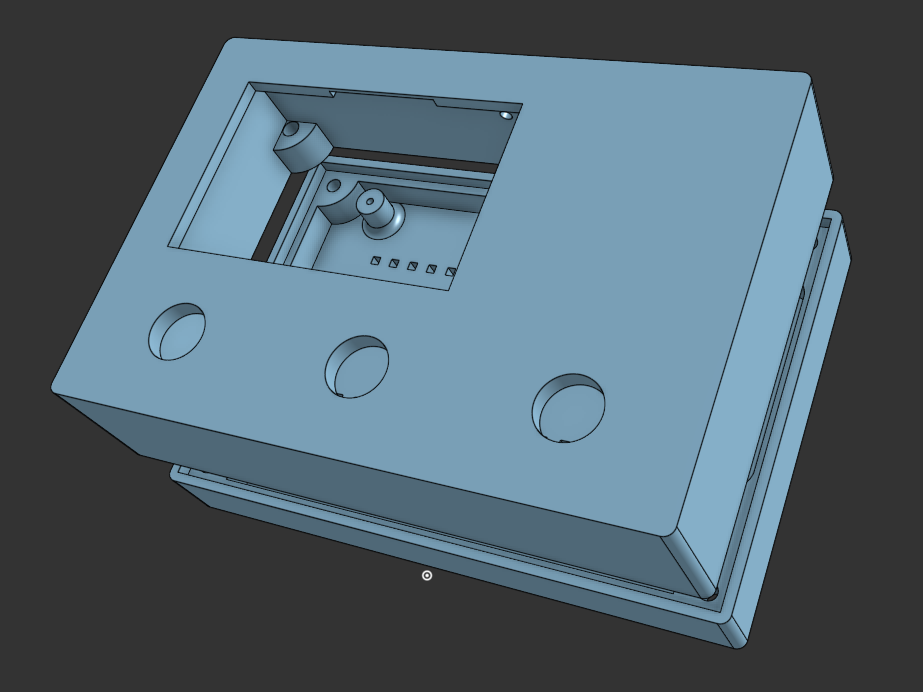
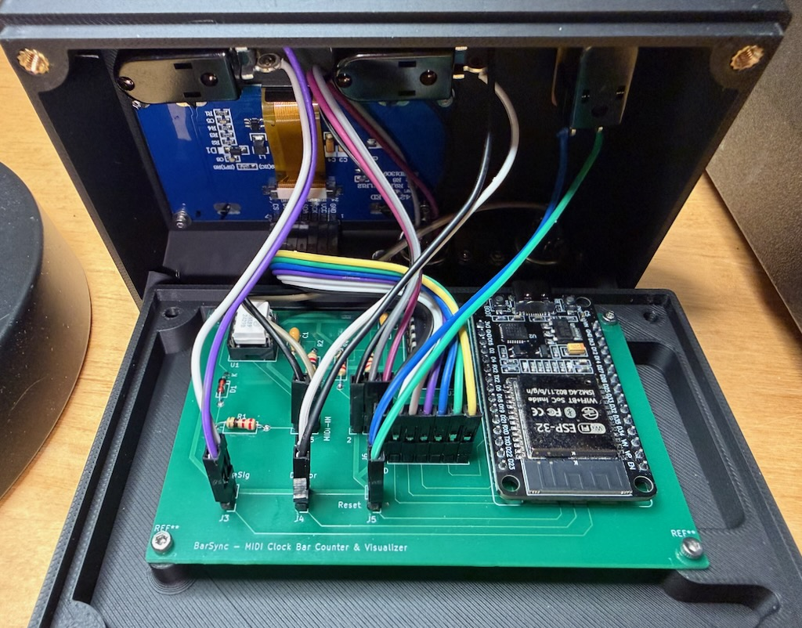

<picture><source media="(prefers-color-scheme: dark)" srcset="images/BarSync_logo_white.svg"><source media="(prefers-color-scheme: light)" srcset="images/BarSync_logo.svg"></picture>

MIDI Clock 
Bar Counter & Visualizer 
-Always in Time.-

 
 

*[English version](README.md)*

BarSync ist ein ESP32-basiertes Gerät, das eine eingehende MIDI-Clock empfängt
und Bar-Position, Beat-Fortschritt, Tempo und verstrichene Spielzeit auf
einem 128×64-OLED-Display anzeigt.

## Status (Stand 06.09.2026)

BarSync - Desktopversion (dieses Gerät)
- Aktueller FW Stand 1.2.2  
    Neue Funktionen: MIDI-Analyzer durch MIDI Monitor ersetzt (Note/CC/PC/Pitch-Bend-Log, MIDI-Clock- und RUN/STOP-Graph direkt am Gerät), Grid-Trennlinien alle 32 Bars (abschaltbar), Resttakte-Anzeige bei x128, BarSync-Logo im Bootscreen  
    Sonstiges: Menüpunkt "Divisor"/"Divisor Select" final auf "Grid"/"Grid Select" umbenannt, neue Kontraststufen und Standardwerte
- Schaltplan, PCB-Layout (Hardware-Rev. 1.2) und Firmware fertig und getestet
- Platinen zum selbst Bestücken sind angekommen
- Ein passendes, 3D-druckbares Gehäuse liegt hier ab [`enclosure`](enclosure/)
- Bausatz zum Selbstlöten ist bei entsprechendem Interesse angedacht

BarSync - Eurorackversion (in Entwicklung und noch nicht auf Github)
- Code fertig
- PCB-Layout fertig und bestellt
- Schaltplan und PCB-Layout folgen
- 3D-druckbarer Rahmen für Eurorack ist in Entwicklung

*(Bei Interesse am Bausatz und der Eurorackversion: Issue hier im Repo eröffnen oder Kontakt aufnehmen.)*

---

## Was ist das hier?
Never miss the drop...

Mit BarSync behältst du den Überblick über das Arrangement deines Tracks — live oder im Studio. Damit du jederzeit weisst, in welchen Takt du dich befindest, damit Drops, Breaks und Builds dich nie überraschen.

Weil ich auf dem Markt oder in der DIY-Szene kein ähnliches Gerät gefunden habe, habe ich den BarSync entwickelt.
BarSync unterstützt dich bei deiner Live-Performance. Während einer Show hast du meist alle Hände voll zu tun, da verliert man schnell den Überblick übers Timing. Kein Im-Kopf-Taktezählen mehr, damit der Drop im richtigen Moment einsetzt: BarSync zählt und visualisiert die verstrichenen Takte seit einem Startpunkt, den du selbst festlegst. Entweder ist dies das erste MIDI-Clock-Signal deines Sequencers, oder du setzt ihn per Reset-Taster jederzeit neu. So weißt du immer, in welchem Takt du dich befindest. Die Visualisierung passt sich dabei deinen Bedürfnissen an (1-128 Bars bzw. Takte können angezeigt werden).

## Features

- Bar-/Beat-Zähler, synchron zur eingehenden MIDI-Clock (24 PPQN)
- Grid-Fortschrittsbalken (x1 bis x128 Bars), Grundfläche bleibt konstant,
  Kachelgröße passt sich an
- 5 wählbare Taktarten (2/4, 3/4, 4/4, 5/4, 7/8)
- Reset-Taster: zwei Stufen (kurz = Taktende, mittel/halten = Zyklusende) — pro Stufe getrennt einstellbar, ob dabei auch die Spielzeit zurückgesetzt wird (Default: ja). Zusätzlich eine eigenständige "SET 1.1"-Funktion (Standardbelegung des Custom-Tasters) zum sofortigen Neusetzen des Beatmusters, quantisiert (auf den nächstgelegenen Beat gerundet) oder sofort (roher Tick) — im Einstellungsmenü wählbar
- MIDI Monitor (Note/CC/PC/Pitch-Bend-Log, MIDI-Clock- und RUN/STOP-Graph) direkt am Gerät
- Nudge-Modus zum manuellen Ausgleich von Clock-Phasendrift
- MIDI-Thru
- Standby (Light Sleep) bei MIDI-Inaktivität
- Einstellungsmenü direkt am Gerät (keine App/Software nötig)

## Bedienung

Kurz zusammengefasst — vollständige Anleitung in
[`docs/BarSync_Quickstart_DE.pdf`](docs/BarSync_Quickstart_DE.pdf):

| Taste | Funktion |
|---|---|
| Custom-Taster (kurz) | SET 1.1 (Beatmuster neu setzen)* |
| Custom-Taster (1s halten) | MIDI Monitor ein/aus** |
| Grid (kurz) | Anzahl der angezeigten Takte im Grid wechseln (x1–x128) |
| Reset (kurz/mittel) | Reset-Stufe 1/2 |
| Custom-Taster + Grid gleichzeitig | Nudge-Modus ein/aus |
| Reset beim Booten 1s halten | Einstellungsmenü |

*Im Setup einstellbar: Custom-Taster zum Durchschalten der Taktarten oder SET1.1 (default)  
**Im MIDI-Monitor-Screen löscht der Reset-Taster die Note/CC-Liste, statt die normale Reset-Funktion auszulösen.

---

## Cool! Wie komme ich da ran?

Wenn Du das Gerät nachbauen möchtest siehe [LICENSE](LICENSE), findest Du hier die entsprechende Firmware, den Schaltplan und die Teileliste. Ich habe auch eine Platine entwickelt, deren Layout ebenfalls hier zu finden ist. Da es sich aber um ein recht einfaches Layout handelt, kannst Du auch eine Lochrasterplatine oder sogar ein Breadboard benutzen, um den BarSync nachzubauen. Darüber hinaus ist Basiswissen im Umgang mit dem ESP32, dem Lötkolben sowie der Elektronik von Vorteil.

Kurz zusammengefasst: Aktuell befindet sich das Projekt noch im kompletten DIY-Stadium. Bei entsprechender Resonanz gedenke ich, einen Bausatz für den Barsync anzubieten. Dieser käme dann mit einem 3D-gedruckten Gehäuse, einer Platine und allen benötigten elektronischen Bauteilen zum Selbstbestücken. Es blieben dann nur noch das Löten und das Flashen des ESP32 übrig.

## Nachbau

- Vollständiger [`Schaltplan`](hardware/kicad/BarSync/BarSync_schematic.pdf)  
- PCB-Layout und Gerber-Dateien liegen in [`hardware/`](hardware/)  
- Vollständige Stückliste: [`hardware/BarSync_BOM.md`](hardware/BarSync_BOM.md)  
- Aufbauanleitung: [`hardware/BarSync_Aufbauanleitung.md`](hardware/BarSync_Aufbauanleitung.md)  
- 3D-druckbares Gehäuse liegt hier ab [`enclosure`](enclosure/)  

## Was ist drinn?
Erster Aufbau mit der neuen Paltine!  

## Wesentliche Hardware

- ESP32 Dev Board (30-Pin DOIT-Layout)
- SSD1309 OLED, 2,42", 128×64, SPI
- 3 Taster (Custom, Grid, Reset)

## Firmware flashen

1. Arduino IDE installieren, ESP32-Boardunterstützung hinzufügen
2. Bibliotheken installieren: **"MIDI Library"** (FortySevenEffects), **"U8g2"** (olikraus)
3. [`firmware/barsync.ino`](firmware/barsync.ino) öffnen, Board "ESP32 Dev Module" wählen, hochladen

## Lizenz

Dieses Projekt steht unter **CC BY-NC-SA 4.0** — siehe [LICENSE](LICENSE).
Freie Nutzung, Veränderung und Weitergabe für **nicht-kommerzielle** Zwecke,
unter Namensnennung und Weitergabe unter gleichen Bedingungen. Für eine
kommerzielle Nutzung bitte Kontakt aufnehmen.

---

*[English version](README.md)*

*Entwickelt mit viel Debugging, MIDI-Timing-Tiefenanalyse und
gelegentlichem Zwischenstopp bei einem Space-Invaders-Klon.*
