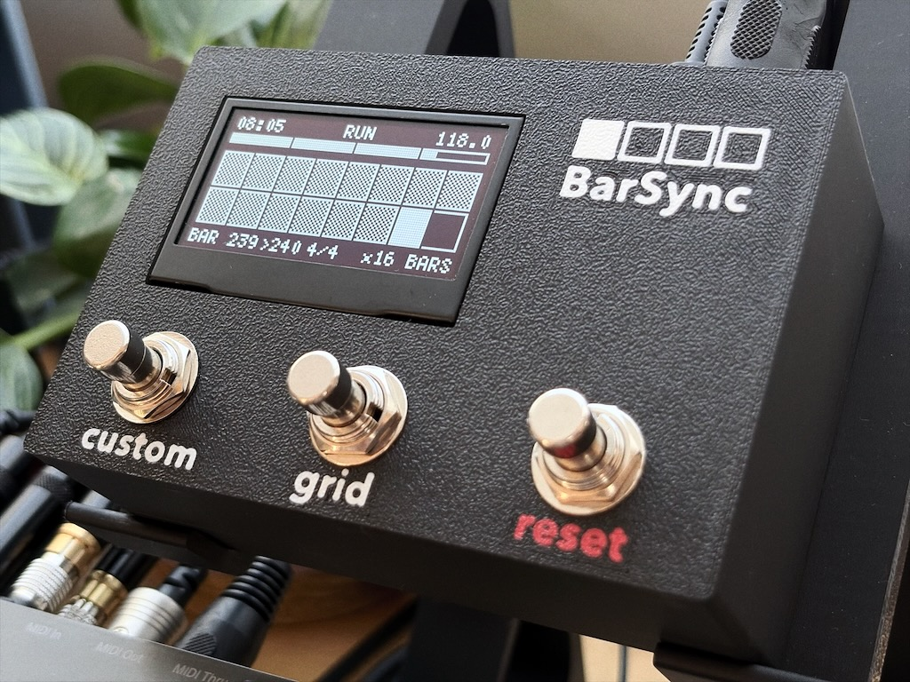

# BarSync

*[Deutsche Version](README.md)*

**MIDI Clock Bar Counter & Visualizer**    -*Always in Time.*-

BarSync is an ESP32-based device that receives an incoming MIDI clock and
displays bar position, beat progress, tempo, and elapsed play time on a
128×64 OLED display.

## Status (as of 2026-09-04)

BarSync - Desktop version (this device)
- Current firmware: 1.2.1   
    New features: settings menu structure completely reworked, MIDI Clock Analyzer completely reworked   
    Bugfixes: waking from standby with an already-running clock improved, short button presses now detected reliably, MIDI tick timing corrected (no more render-induced jitter)
- Schematic, PCB layout (hardware rev. 1.2), and firmware finished and tested
- PCBs for self-assembly have arrived
- A matching 3D-printable enclosure is available here [`enclosure`](enclosure/)
- A solder-it-yourself kit is being considered, depending on interest

BarSync - Eurorack version (in development, not yet on GitHub)
- Code finished
- PCB layout finished and ordered
- Schematic and PCB layout to follow
- 3D-printable Eurorack frame is in development

*(Interested in the kit or the Eurorack version? Open an issue in this repo or get in touch.)*

---

## What is this?
Never miss the drop...

BarSync keeps you locked into your track's arrangement — live or in the studio. Know exactly where you stand in the bar count, so drops, breaks and builds never catch you off guard.

Since I couldn't find anything similar on the market or in the DIY scene, I built BarSync.
BarSync supports you during your live performance. During a show your hands are usually full, and it's easy to lose track of the timing. No more counting bars in your head to land the drop at the right moment: BarSync counts and visualizes the bars elapsed since a starting point you define yourself. That starting point can be the first MIDI clock signal from your sequencer, or you can reset it at any time with the reset button. This way you always know exactly which bar you're in. The visualization adapts to your needs (1-128 bars can be displayed).

## Features

- Bar/beat counter, synced to the incoming MIDI clock (24 PPQN)
- Grid progress bar (x1 to x128 bars) — overall area stays constant,
  tile size adapts accordingly
- 5 selectable time signatures (2/4, 3/4, 4/4, 5/4, 7/8)
- Reset button: two stages (short = bar end, medium/hold = cycle end) — each independently configurable whether it also resets the elapsed play time (default: yes). Plus a standalone "SET 1.1" function (default custom-button role) to instantly re-anchor the beat pattern, either quantized (rounded to the nearest beat) or instant (raw tick) — selectable in the settings menu
- Built-in MIDI analyzer (jitter, interval, BPM range) right on the device
- Nudge mode for manually compensating clock phase drift
- MIDI-Thru
- Standby (light sleep) on MIDI inactivity
- On-device settings menu (no app or software required)

## Operation

Quick overview — full guide in
[`docs/BarSync_Quickstart_EN.pdf`](docs/BarSync_Quickstart_EN.pdf):

| Button | Function |
|---|---|
| Custom button (short) | SET 1.1 (re-anchor beat pattern)* |
| Custom button (hold 1s) | Toggle MIDI analyzer* |
| Grid (short) | Change the number of bars shown in the grid (x1–x128) |
| Reset (short/medium) | Reset stage 1/2 |
| Custom button + Grid together | Toggle nudge mode* |
| Hold Reset 1s at boot | Settings menu |

*The custom button is freely assignable — the functions shown here reflect the current firmware default.

## Cool! How do I get one?

If you'd like to build the device yourself, see [LICENSE](LICENSE) — you'll find the corresponding firmware, schematic, and parts list here. I've also designed a PCB, whose layout is included as well. Since it's a fairly simple layout, you can also use perfboard or even a breadboard to build BarSync. Basic knowledge of the ESP32, a soldering iron, and general electronics will be helpful.

In short: the project is currently still in a full DIY stage. Depending on interest, I'm considering offering a BarSync kit. It would come with a 3D-printed enclosure, a PCB, and all the necessary electronic components ready to be assembled. All that would be left to do is soldering and flashing the ESP32.

---

## Building Your Own

Full [`schematic`](hardware/kicad/BarSync/BarSync_schematic.pdf), PCB layout, and Gerber files are in
[`hardware/`](hardware/).
Full bill of materials: [`hardware/BarSync_BOM.en.md`](hardware/BarSync_BOM.en.md)
Assembly guide: [`hardware/BarSync_Aufbauanleitung.en.md`](hardware/BarSync_Aufbauanleitung.en.md)
3D-printable enclosure available here: [`enclosure`](enclosure/)

## Key Hardware

- ESP32 dev board (30-pin DOIT layout)
- SSD1309 OLED, 2.42", 128×64, SPI
- 3 buttons (custom, grid, reset)

## Flashing the Firmware

1. Install the Arduino IDE, add ESP32 board support
2. Install libraries: **"MIDI Library"** (FortySevenEffects), **"U8g2"** (olikraus)
3. Open [`firmware/barsync.ino`](firmware/barsync.ino), select board "ESP32 Dev Module", upload

## License

This project is licensed under **CC BY-NC-SA 4.0** — see [LICENSE](LICENSE).
Free to use, modify, and share for **non-commercial** purposes, with
attribution and share-alike terms. For commercial use, please get in touch.

---

*[Deutsche Version](README.md)*

*Built with a lot of debugging, deep MIDI timing analysis, and an
occasional detour into building a Space Invaders clone.*
